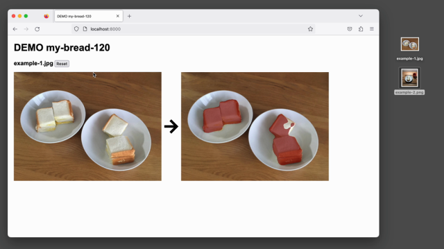

# DEMO my bread 120

This is a bread pixels predict demo using the model of fine-tuning my-bread-120 dataset with Deeplab V3 plus with Keras and TensorFlow.




## Use demo

[https://mindboard.github.io/my-bread-120-demo/](https://mindboard.github.io/my-bread-120-demo/)

Usage : See this video: [https://youtu.be/hxTpgBQHPCA](https://youtu.be/hxTpgBQHPCA)


## About Tensorflow.js

Index.html using Tensorflow.js and TFLite support for Tensorflow.js.

See more details:
- https://github.com/tensorflow/tfjs
- https://github.com/tensorflow/tfjs/tree/master/tfjs-tflite


## Build and run this demo in local

Build environments:

```
$ node -v
v18.12.1
$ npm -v
8.19.2
```

1. npm install
2. npx webpack
3. python3 -m http.server 8000 --directory ./docs
4. http://localhost:8000/

If you do not have any test bread images, you can use these images ./imgs/example-1.jpg and ./imgs/example-2.jpg.
